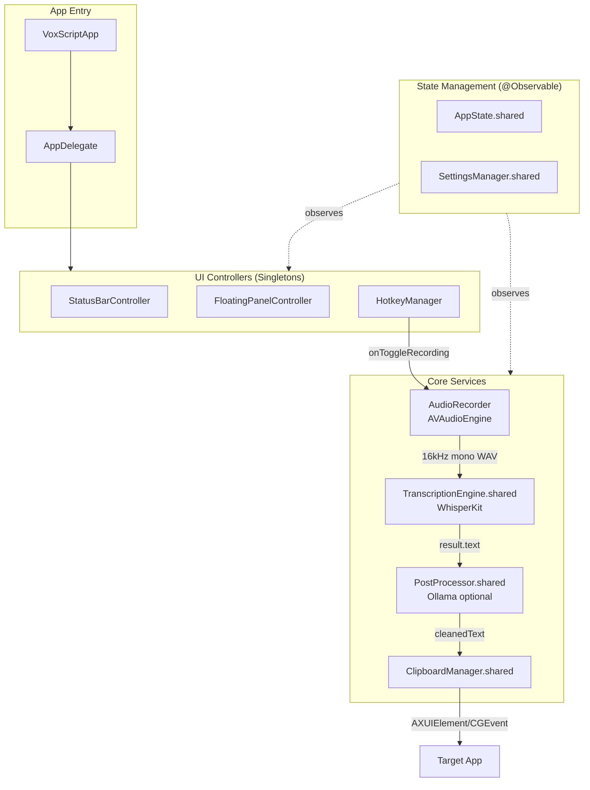

# CLAUDE.md

This file provides guidance to Claude Code (claude.ai/code) when working with code in this repository.

## Build Commands

```bash
# Open in Xcode
open VoxScript.xcodeproj

# Build Release
xcodebuild -project VoxScript.xcodeproj -scheme VoxScript -configuration Release

# Build Debug
xcodebuild -project VoxScript.xcodeproj -scheme VoxScript -configuration Debug

# Run tests
xcodebuild -project VoxScript.xcodeproj -scheme VoxScript test
```

## Architecture

VoxScript is a macOS menu bar dictation app using WhisperKit for 100% local speech-to-text on Apple Silicon.



### Recording Pipeline Flow

1. **Hotkey triggered** → HotkeyManager invokes callback
2. **Audio capture** → AudioRecorder records via AVAudioEngine, converts to 16kHz mono WAV
3. **Transcription** → TranscriptionEngine processes with WhisperKit (CoreML/ANE)
4. **Post-processing** (optional) → PostProcessor sends to Ollama for cleanup
5. **Text insertion** → ClipboardManager uses multi-strategy fallback:
   - Accessibility API (AXUIElement) - preferred
   - CGEvent character typing
   - Clipboard + Cmd+V paste

## Key Implementation Details

### Singleton Pattern
All shared services use `static let shared` - always use the singleton:
- `TranscriptionEngine.shared`
- `AppState.shared`
- `SettingsManager.shared`
- `ClipboardManager.shared`
- `PostProcessor.shared`

### WhisperKit Model Names
Must match exact IDs from `argmaxinc/whisperkit-coreml`:
- `openai_whisper-large-v3_turbo` (default, note underscore before turbo)
- `openai_whisper-large-v3`
- `openai_whisper-small.en`
- `openai_whisper-base`
- `openai_whisper-tiny`

### Text Insertion Challenges (macOS Sonoma)
macOS Sonoma has stricter security. ClipboardManager implements multi-strategy fallback because:
- CGEvent posting sometimes blocked
- AppleScript keystroke requires extensive permissions
- Accessibility API most reliable but inconsistent
- Terminal apps require special handling (detected and use different insertion)

### No Sandbox
App requires disabled sandbox for global hotkeys, Accessibility API, and Ollama HTTP.

## Dependencies

| Package | Purpose |
|---------|---------|
| WhisperKit 0.15.0+ | Speech-to-text engine |
| KeyboardShortcuts 2.0.0+ | Global hotkey handling |
| Ollama (optional runtime) | Post-processing text cleanup at localhost:11434 |

## Common Modifications

**Add new setting:** Add property to `SettingsManager` with UserDefaults key → Add UI in appropriate settings tab

**Add new hotkey:** Add to `KeyboardShortcuts.Name` extension in `Settings.swift` → Setup in `HotkeyManager.setupKeyboardShortcuts()` → Add callback in AppDelegate

**Change model selection:** Add to `WhisperModel.availableModels` array → Update `TranscriptionEngine.getModelName()`

## Release Process

When asked to "release", "publish", or "push a new version", follow this complete process:


### Step-by-Step Release

1. **Update version numbers** in `VoxScript/Info.plist`:
   - `CFBundleShortVersionString` (e.g., "1.1")
   - `CFBundleVersion` (e.g., "2")

2. **Build the DMG:**
   ```bash
   ./build-dmg.sh
   ```

3. **Sign the DMG with Sparkle:**
   ```bash
   ./scripts/sign-update.sh build/VoxScript-X.Y.dmg
   ```
   This outputs the `sparkle:edSignature` and `length` values.

4. **Update `appcast.xml`** with a new `<item>` entry containing:
   - New version numbers (`sparkle:version`, `sparkle:shortVersionString`)
   - The signature from step 3
   - The file size (length) from step 3
   - Updated download URL

5. **Create GitHub Release:**
   ```bash
   gh release create vX.Y build/VoxScript-X.Y.dmg \
     --title "VoxScript X.Y" \
     --notes "Release notes here"
   ```

6. **Commit and push:**
   ```bash
   git add -A
   git commit -m "release: vX.Y - description of changes"
   git push origin main
   ```

### Important Files

| File | Purpose |
|------|---------|
| `appcast.xml` | Sparkle update feed (must be on main branch for auto-updates) |
| `scripts/sparkle-setup.sh` | Generate EdDSA signing keys (run once) |
| `scripts/sign-update.sh` | Sign DMG files for Sparkle |
| `.sparkle-keys/` | Private signing keys (never commit!) |
| `build-dmg.sh` | Creates distributable DMG installer |

### Auto-Update Configuration

- **Feed URL:** `https://raw.githubusercontent.com/davidcv5/VoxScript/main/appcast.xml`
- **Public Key:** Stored in `Info.plist` under `SUPublicEDKey`
- **Private Key:** Stored in macOS Keychain and `.sparkle-keys/sparkle_private_key`
